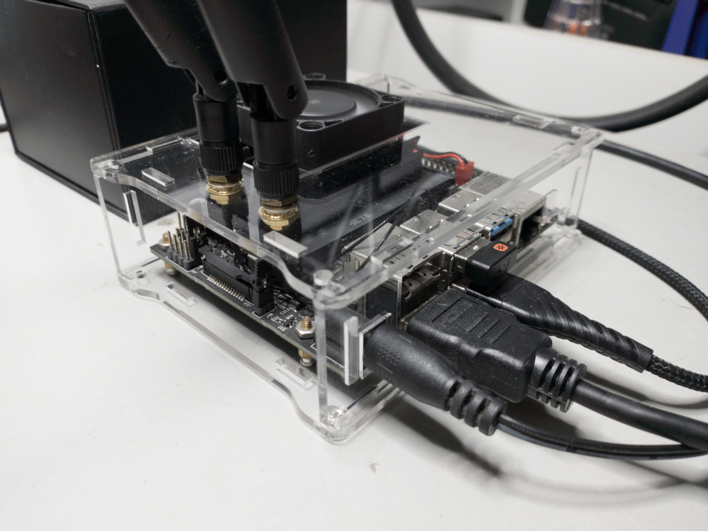

# codes_nano
This repository conteins, all codes for my jetson nano devkit board.

The Jetson Nano is a single-board computer developed by NVIDIA. It is designed for use in embedded systems, robotics, and other applications that require high computational power and low power consumption. The Jetson Nano is powered by a quad-core ARM Cortex-A57 CPU, and a 128-core NVIDIA Maxwell GPU. It has 4GB of LPDDR4 RAM, and supports Gigabit Ethernet, USB 3.0, and HDMI. Additionally, it has a 40-pin GPIO header, and supports a wide range of sensors and peripherals. The Jetson Nano can run a variety of operating systems, including Ubuntu and JetPack (a version of Linux developed by NVIDIA).

## Dependecies

### OS

- Ubunto 20.04: https://github.com/Qengineering/Jetson-Nano-Ubuntu-20-image

### basics

#### jtop
- $ sudo apt-get update
- $ sudo apt-get upgrade
- $ sudo apt-get install python-pip
- $ sudo -H pip install -U jetson-stats
- $ sudo reboot

### synergy 

- https://github.com/symless/synergy-core
