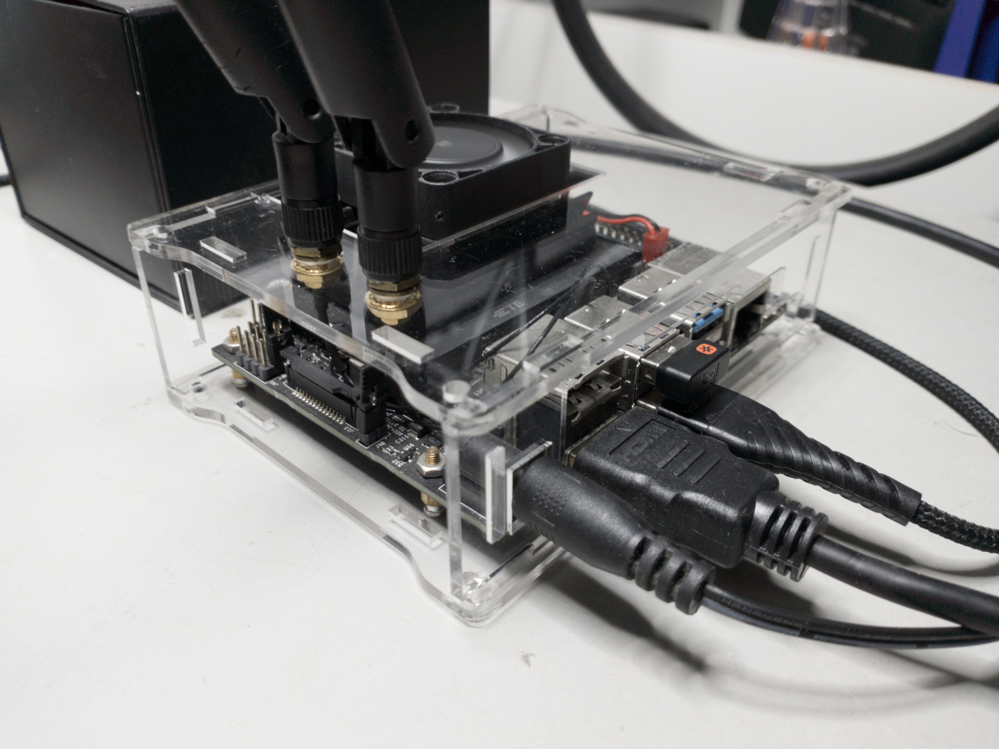

# codes_nano
This repository conteins, all codes for my jetson nano devkit board.

## Dependecies

### OS

- Ubunto 20.04: https://github.com/Qengineering/Jetson-Nano-Ubuntu-20-image

### basics

- pip install jetson-stats

### synergy 

- https://github.com/symless/synergy-core
