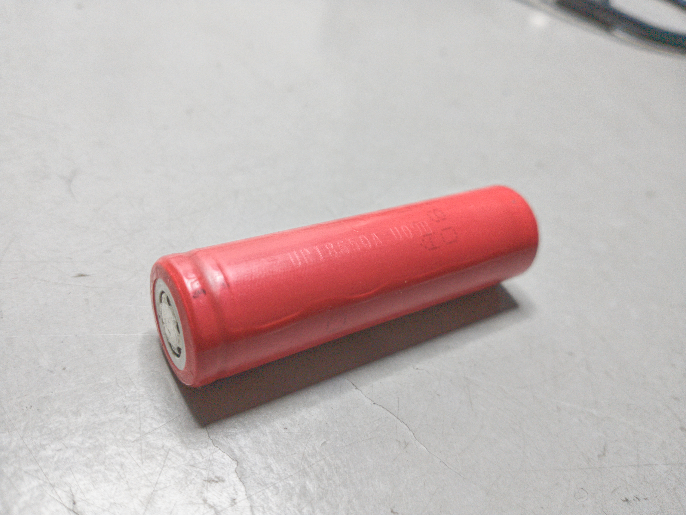

# cyber_nano

Development of an electric vehicle in scale with Jetson nano.

||
|:--:|
| Cyber Nano first version |

## Dependencies

### basics

- pip install jetson-stats

### synergy 

- https://github.com/symless/synergy-core

## Hardware

 Battery Pack

 Lithium Cell Sanyo ur18650a

||
|:--:|
| Lithium Cell Sanyo ur18650a |
- Form factor: 18650
- Manufacture: Sanyo ur18650a
- Capacity: 2150mAh
- Voltage: 3.6V Nominal 3V min - 4.2V max
- Nominal dischard: 1CA = 2.15A
- max dischard current: 2.0CA = 4.30A
- Charge current: 1505mA
- Weight: 43.0g
#### Battery Pack
- Pack with 8p cells: 17200mAh
- Pack with 4P 2S cells: 8600mAh

|
|:--:|
|Pack load test ur18650a 4P 2S|

 Lithium Cell Sanyo ur18650ZY

- Form factor: 18650
- Manufacture: Sanyo ur18650ZY
- Capacity: 2450mAh
- Voltage: 3.7V Nominal 3V min - 4.2V max
- Nominal dischard: 1CA = 2.45A
- max dischard current:  5A
- Charge current: 1750mA
- Weight: 48.0g
#### Battery Pack
- Pack with 8p cells: 19600mAh
- Pack with 4P 2S cells: 9800mAh

|
|:--:|
|Pack load test ur18650ZY 8P|

### BMS (battery management system)

This BMS control the carge of one lithium cell.

|
|:--:|
|BMS 1S|

- 3 - 4.2V range
- 5A max current output
- 1/ DW01-A lithium battery protection IC
- 2/ 8205 1k1504 mosfet (Fs8205a)

