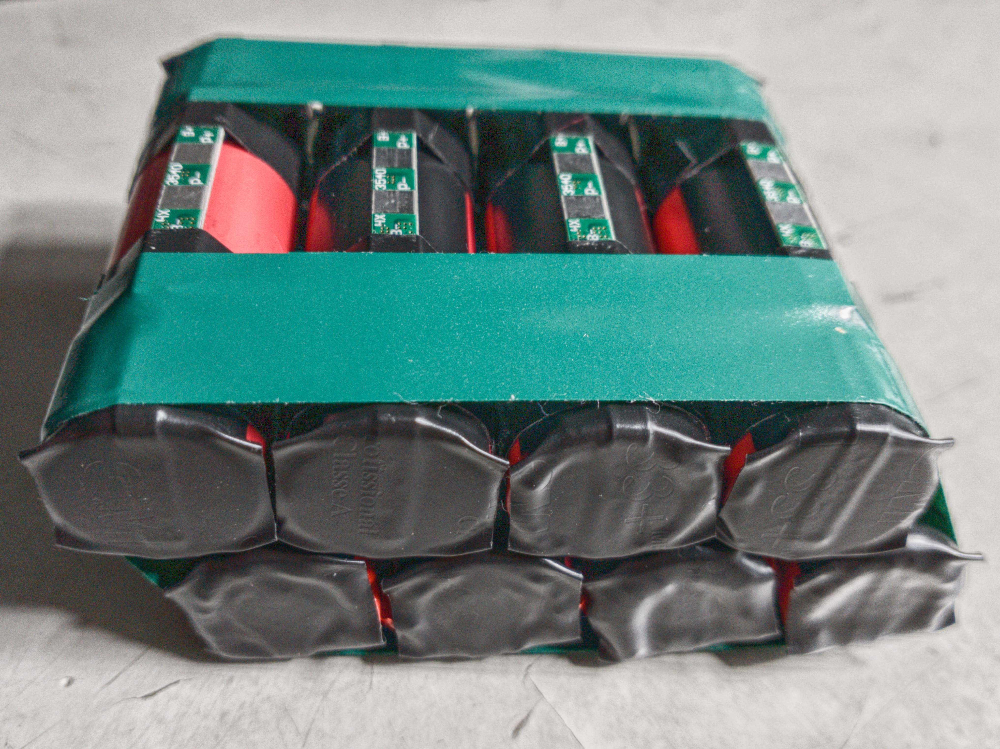

# cyber_nano

Development of an electric vehicle in scale with Jetson nano.

||
|:--:|
| Cyber Nano first version |

## Dependencies

### basics

- pip install jetson-stats

### synergy 

- https://github.com/symless/synergy-core

## Hardware

 Battery Pack

 Lithium Cell Sanyo ur18650a

||
|:--:|
| Lithium Cell Sanyo ur18650a |
- Form factor: 18650
- Manufacture: Sanyo ur18650a
- Capacity: 2150mAh
- Voltage: 3.6V Nominal 3V min - 4.2V max
- Nominal dischard: 1CA = 2.15A
- max dischard current: 2.0CA = 4.30A
- Charge current: 1505mA
- Weight: 43.0g
- internal resistence:
#### Battery Pack plastic spring holder
- Pack with 8p cells: 17200mAh
- Pack with 4P 2S cells: 8600mAh

|
|:--:|
|Pack load test ur18650a 4P 2S|

 Lithium Cell Sanyo ur18650ZY

||
|:--:|
| Lithium Cell Sanyo ur18650ZY |

- Form factor: 18650
- Manufacture: Sanyo ur18650ZY
- Capacity: 2450mAh
- Voltage: 3.7V Nominal 3V min - 4.2V max
- Nominal dischard: 1CA = 2.45A
- max dischard current:  5A
- Charge current: 1750mA
- Weight: 48.0g
- internal resistence: ~$300 \mathsf{m\Omega}$
#### Battery Pack plastic spring holder
- Pack with 8p cells: 19600mAh
- Pack with 4P 2S cells: 9800mAh

|
|:--:|
|Pack load test ur18650ZY 8P|

### BMS (battery management system)

This BMS control the carge of one lithium cell.

|
|:--:|
|BMS 1S|

- 3 - 4.2V range
- 5A max current output
- 1/ DW01-A lithium battery protection IC
- 2/ 8205 1k1504 mosfet (Fs8205a)

### Spot welder

|
|:--:|
|Spot welder|

|
|:--:|
|Spot welder specifications|

### Cell with BMS

|
|:--:|
|Cell with BMS|

### Cell spot welded

|
|:--:|
|Cell spot welded|

#### Cell with BMS discarge test

|
|
|:--:|
|Cell with BMS discarge test|

### Pack with BMS spot welded

|
|:--:|
|Pack with BMS spot welded|

### Pack top wiring

|
|:--:|
|Pack top wiring|

### Pack botton wiring

|
|:--:|
|Pack botton wiring|

### Pack compact model weight (cell ur18650ZY)

|
|:--:|
|Pack compact model weight (cell ur18650ZY)|

### Pack removable cell model weight (cell ur18650a)

|
|:--:|
|Pack removable cell model weight (cell ur18650a)|

## Steering control

- max rigth 1ms pulse at 50hz ~205 on pca9685 driver
- center 1.4ms pulse at 50hz ~286 on pca9685 driver
- max left 1.7ms pulse at 50hz ~348 on pca9685 driver

PWM Driver: pca9685 I²c 12bits pwm resolution \
1 / 50hz = 20ms periode\
20ms / 2¹² = 4.882ms\
0.0048828125 * 204.8 = 1ms pulse\
0.0048828125 * 286.72 = 1.4ms pulse\
0.0048828125 * 348.16 = 1.7ms pulse

## Eletric Motor control

